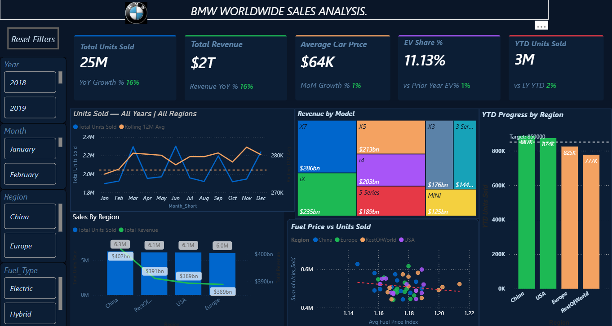

# 🚗 BMW Worldwide Sales Analysis Dashboard

> An interactive Power BI dashboard analyzing BMW's global sales performance from 2018 to 2025 across models, regions, and fuel types.

---

## 📌 Project Title
**BMW Worldwide Sales Intelligence Dashboard — 2018 to 2025**

---

## 📋 Overview

This Power BI dashboard provides a comprehensive analysis of BMW's worldwide vehicle sales over an 8-year period (2018–2025). It covers multiple dimensions including:

- Regional sales performance across 6 global markets
- Model-wise revenue and unit contribution
- Fuel type trends: ICE, Hybrid, and Electric Vehicles (EV)
- Year-over-Year (YoY) and Month-over-Month (MoM) growth patterns
- EV adoption trends and market share evolution

The dashboard is built with a dark-themed, branded aesthetic ("BMW Dark Analytics" theme) and is structured across **6 interactive pages** for layered storytelling.

---

# 🚗 BMW Worldwide Sales Analysis Dashboard



> An interactive Power BI dashboard analyzing BMW's global sales performance from 2018 to 2025 across models, regions, and fuel types.

---

## 💼 Business Problem

BMW, like all major automotive manufacturers, faces complex challenges:

- **Sales visibility across diverse global markets** is fragmented and hard to monitor in real time
- **EV transition tracking** is critical as regulations mandate increasing electrification
- **Model-level performance** is difficult to assess without granular drill-downs
- **Revenue vs. volume imbalances** across regions go undetected without consolidated dashboards
- **Year-over-year comparisons** are time-consuming without automated KPIs

This dashboard solves these problems by consolidating all sales data into a single, filterable, self-service analytics tool.

---

## 🎯 Objective / Goal

- Provide **executive-level visibility** into BMW's global sales health
- Enable **regional and model-level drill-downs** for operational decisions
- Track the **EV adoption curve** over time to align with sustainability goals
- Surface **growth trends and anomalies** through YoY and MoM KPIs
- Empower stakeholders to make **data-driven decisions** without relying on static reports

---

## 💡 Key Insights

- 📈 **Consistent revenue growth** observed from 2018–2025, driven by premium model expansion
- 🔋 **EV share increased significantly** post-2021, with the i4 and iX series leading adoption
- 🌍 **China and Europe** are the top-contributing regions by units sold
- 🏆 **X-Series SUVs** (X3, X5, X7) dominate volume across all markets
- ⚡ **Hybrid vehicles** peaked in 2022–2023 as a transition bridge to full EV
- 📉 **MoM growth volatility** spikes observed in Q1 and Q4, likely tied to inventory cycles
- 💰 **Average car price** has trended upward, reflecting a shift toward premium and electric models

---

## 🛠️ Tools & Technologies Used

| Tool / Technology | Purpose |
|---|---|
| **Power BI Desktop (2026.04)** | Dashboard development and data modelling |
| **DAX (Data Analysis Expressions)** | Custom measures and KPI calculations |
| **Power Query (M Language)** | Data transformation and cleaning |
| **CSV Dataset** | Source data — BMW Global Sales 2018–2025 |
| **BMW Dark Analytics Theme** | Custom JSON visual theme for branding |
| **GitHub** | Version control and project hosting |

---

## ✨ Features / Highlights

**Dashboard Pages:**
- `Executive Overview` — Top-level KPIs and global sales snapshot
- `Sales Deep Dive` — Model and region granular breakdown
- `EV & Trends` — Electrification tracking with forecasting visuals
- `Model Detail` — Individual model deep-dive with scatter and combo charts
- `Region Detail` — Regional performance with waterfall and area charts
- `Tooltip – Monthly` — Dynamic monthly tooltip supporting other pages

**Key Features:**
- 🎛️ **27 Advanced Slicers** — Filter by Year, Region, Model, Fuel Type, Quarter
- 📊 **16 KPI Cards** — Total Units Sold, Total Revenue, YoY Growth %, EV Share %, MoM Growth %, YTD comparisons, and more
- 📉 **Waterfall Charts** — Visualize period-over-period revenue changes
- 📈 **Line + Column Combo Charts** — Compare units sold vs. revenue trends
- 🌳 **Treemap** — Model share visualization
- 🔵 **Scatter Chart** — Price vs. volume positioning by model
- 📐 **Stacked Area Charts** — Fuel type mix evolution over time
- 🔢 **Pivot Tables** — Detailed tabular breakdowns
- 🎨 **Dark BMW-branded theme** with BMW logo integration
- ⚡ **Action Buttons** for page navigation

---

## 🏢 How It Helps

| Stakeholder | Benefit |
|---|---|
| **C-Suite / Executives** | Instant view of global revenue health and YoY performance |
| **Sales Managers** | Identify best and worst performing regions and models |
| **Product Teams** | Understand which models drive volume vs. revenue |
| **Strategy Teams** | Track EV transition progress against targets |
| **Finance Teams** | Monitor average selling price and revenue trends |

This dashboard eliminates manual reporting, reduces analysis time from days to seconds, and enables proactive rather than reactive decision-making.

---

## 📁 Repository Structure

```
BMW-Sales-Dashboard/
│
├── BMW_Dashboard.pbix          # Power BI dashboard file
├── README.md                   # Project documentation
│
└── dataset/
    └── bmw_global_sales_2018_2025.csv   # Source dataset (8,640 records)
```

---

## 🚀 Getting Started

1. **Clone this repository**
   ```bash
   git clone https://github.com/harshkhandelwal04/BMW-Sales-Dashboard.git
   ```

2. **Open the dashboard**
   - Install [Power BI Desktop](https://powerbi.microsoft.com/desktop/) (free)
   - Open `BMW_Dashboard.pbix`

3. **Explore the dataset**
   - Raw data is in `dataset/bmw_global_sales_2018_2025.csv`
   - 8,640 records across 7 columns: Year, Month, Region, Model, Fuel Type, Units Sold, Revenue

---

## 📊 Dataset Overview

| Column | Description |
|---|---|
| `Year` | Sales year (2018–2025) |
| `Month_Num` | Month number (1–12) |
| `Region` | Sales region (Europe, North America, China, Asia Pacific, Middle East & Africa, Latin America) |
| `Model` | BMW model name (15 models including EV lineup) |
| `Fuel_Type` | ICE / Hybrid / EV |
| `Units_Sold` | Number of vehicles sold |
| `Revenue` | Total revenue in USD |

---

## 🏁 Conclusion

The **BMW Worldwide Sales Analysis Dashboard** is a production-ready Power BI solution that transforms raw sales data into actionable business intelligence. It enables stakeholders at all levels — from executives to regional managers — to monitor performance, spot trends, and make evidence-based decisions. The integration of EV tracking, regional breakdowns, and YoY/MoM KPIs makes it a comprehensive tool for navigating the evolving automotive landscape.

---

## 👤 Author

**Harsh Khandelwal**
- GitHub: [@harshkhandelwal04](https://github.com/harshkhandelwal04)

---

*Built with ❤️ using Microsoft Power BI*
